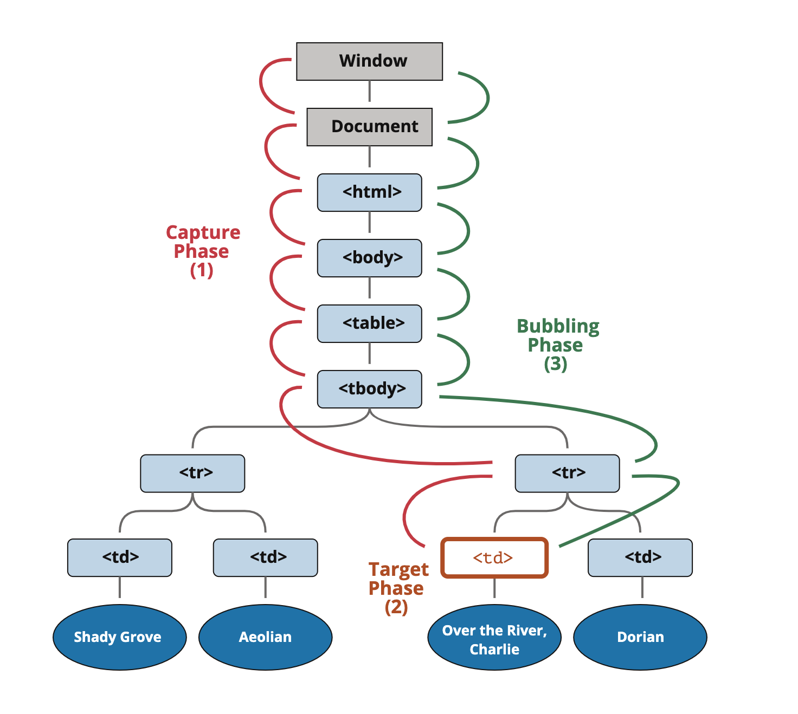

## Event bubbling
### What is event bubbling?
- When an event happen on an element, first it runs handlers on it, then on its parent, and then all the way up on it ancestors
- It normally goes upwards till *html* tag, and then to *document* object 
### event.target 
- The most deeply nested element that caused the event is called the target event, accessible as *event.target*
- *event.target*: is the “target” element that initiated the event, it **doesn’t change through the bubbling process**.

### Stop event bubbling
- Any handler may decide that the event has been fully processed and stop the bubbling.
The method for it is event.stopPropagation();

Note: **Don’t stop bubbling without a need!**

## Event capturing
Event capturing is another phase of event process, rarely used in code, sometimes can be useful.

### Three phases of event propagation
1. Capturing phase - the event goes down to the element
2. Targeting phase - the event reaches to the target element
3. Bubbling phase - the event bubbles up from the element


Until now, we only talked about bubbling, because the capturing phase is rarely used.

In fact, the capturing phase was invisible for us, because handlers added using on<event>-property or using HTML attributes or using two-argument addEventListener(event, handler) don’t know anything about capturing, they only run on the 2nd and 3rd phases.

To catch an event on the capturing phase, we need to set the handler capture option to true:

```javascript
elem.addEventListener(..., {capture: true})
// or, just "true" is an alias to {capture: true}
elem.addEventListener(..., true)
```
Note that while formally there are 3 phases, the 2nd phase (“target phase”: the event reached the element) is not handled separately: handlers on both capturing and bubbling phases trigger at that phase.

## Reference
https://javascript.info/bubbling-and-capturing